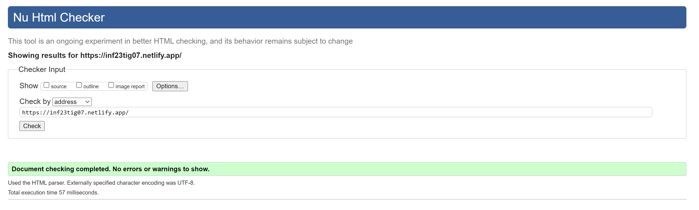

## Chapter III: Product Presentation

A basic website , consisting of 5 static web pages, about the sport Basketball

## Installation/Configuration

Clone the local repository and accessc src folder for code. The site is hoested in [Link](https://Netlify.com)

## Link : [Site](https://www.inf23tig07.netlify.app)

## Implementation Details

Here we have a list of the minimum requirements

# HTML

| Requirements | Example |
| :---: | :---: |
| Table(with _thead, tfoot, colspan, rowspan, tbody_) |    [Link](https://github.com/inf23tig07/inf23tig07/blob/main/src/regras.html#L47)   |
| List (*unordered list*)|      [Link](https://github.com/inf23tig07/inf23tig07/blob/main/src/portugal.html#L45)   |
| Nested List |    [Link](https://github.com/inf23tig07/inf23tig07/blob/main/src/jogadores.html#L38)   |
| Image |   [Link](https://github.com/inf23tig07/inf23tig07/blob/main/src/portugal.html#L16)   |
| Figure |   [Link](https://github.com/inf23tig07/inf23tig07/blob/main/src/jogadores.html#L40)   |
| FigCaption |   [Link](https://github.com/inf23tig07/inf23tig07/blob/main/src/jogadores.html#L42)   |
| Internal Link |    [Link](https://github.com/inf23tig07/inf23tig07/blob/main/src/jogadores.html#L23)   |
| External Link |    [Link](https://github.com/inf23tig07/inf23tig07/blob/main/src/portugal.html#L78)   |
| Form |    [Link](https://github.com/inf23tig07/inf23tig07/blob/main/src/contacto.html#L38)   |

# CSS 
| Requirements | Example |
| :---: | :---: |
| Type selector |   [Link](https://github.com/inf23tig07/inf23tig07/blob/main/src/css/styles.css#L8)   |
| Id selector |    [Link](https://github.com/inf23tig07/inf23tig07/blob/main/src/css/styles.css#L101)   |
| Class Selector |    [Link](https://github.com/inf23tig07/inf23tig07/blob/main/src/css/styles.css#L107)   |
| Pseudo-class Selector |   [Link](https://github.com/inf23tig07/inf23tig07/blob/main/src/css/styles.css#L203)   |
| Attribute Selector |    [Link](https://github.com/inf23tig07/inf23tig07/blob/main/src/css/styles.css#L556)   |
| Combinator Selector |    [Link](https://github.com/inf23tig07/inf23tig07/blob/main/src/css/styles.css#L373)   |
| Text /Font style |    [Link](https://github.com/inf23tig07/inf23tig07/blob/main/src/css/styles.css#L9)   |
| Background style |    [Link](https://github.com/inf23tig07/inf23tig07/blob/main/src/css/styles.css#L13)   |
| List style |    [Link](https://github.com/inf23tig07/inf23tig07/blob/main/src/css/styles.css#L354)   |
| table style |    [Link](https://github.com/inf23tig07/inf23tig07/blob/main/src/css/styles.css#L83)   |
| Responsivity |    [Link](https://github.com/inf23tig07/inf23tig07/blob/main/src/css/styles.css#L141)   |

## Additional Site Files
| Requirement |  Example |
| :---: | :---: |
| XML file |    [Link](https://github.com/inf23tig07/inf23tig07/blob/main/src/jogadores.xml)   |
| XML file Download|    [Link](https://github.com/inf23tig07/inf23tig07/blob/main/src/jogadores.html#L127)   |
| XSD file |    [Link](https://github.com/inf23tig07/inf23tig07/blob/main/src/jogadores.xsd)   |
| JS file |    [Link](https://github.com/inf23tig07/inf23tig07/blob/main/src/js/script.js)   |

## Extra
| Optional |  Example |
| :---: | :---: |
| Favicon |    [Link](https://github.com/inf23tig07/inf23tig07/blob/main/src/contacto.html#L9)   |
| Image Slideshow |    [Link](https://github.com/inf23tig07/inf23tig07/blob/main/src/index.html#L41)   |

## HTML5 and CSS3 Validation: 

